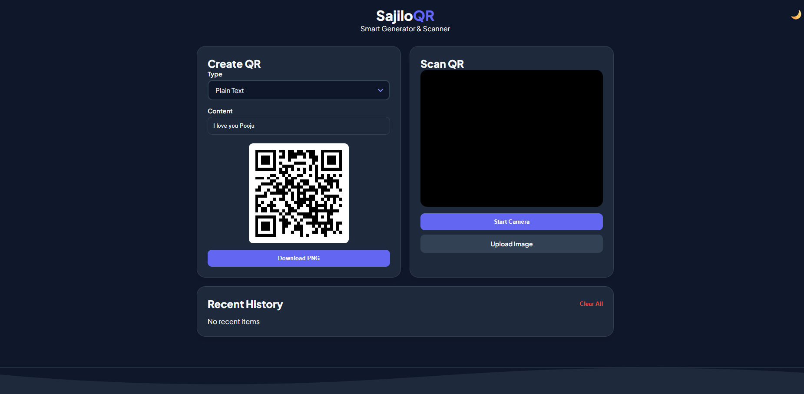
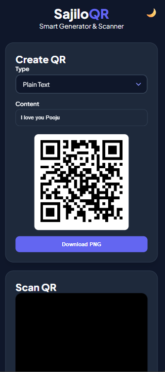
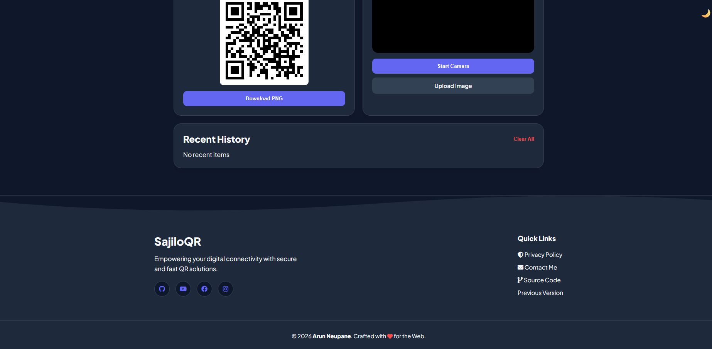

# SajiloQR

### Modern QR Code Generator & Real-time Scanner

SajiloQR is a high-performance, privacy-focused web application designed to generate and scan QR codes with a premium user experience. Built with modern CSS Grid, Glassmorphism design principles, and real-time processing, it offers a seamless workflow for both desktop and mobile users.

!

## Features

- **Real-time Generation:** QR codes update instantly as you type.
- **Advanced Scanner:** High-speed camera scanning using `jsQR` with an animated viewfinder.
- **Multi-format Support:**
  - **URLs:** Automatic `https://` detection.
  - **Text:** Plain text encoding.
  - **Wi-Fi:** Specialized format for SSID and Password.
  - **Email & Phone:** Direct action protocols.
- **Smart History:** Local storage-based history with "Copy to Clipboard" functionality.
- **High-Res Downloads:** Generated QR codes include a white "Quiet Zone" padding for maximum scannability.
- **Theming:** Full Dark Mode support with system preference detection.
- **Privacy First:** 100% client-side processing. Your data never leaves your browser.

## Technology Stack

- **Frontend:** HTML5, CSS3 (Custom Properties & Grid)
- **Icons:** [Font Awesome 6](https://fontawesome.com/)
- **Typography:** [Plus Jakarta Sans](https://fonts.google.com/specimen/Plus+Jakarta+Sans)
- **Scanning Engine:** [jsQR](https://github.com/cozmo/jsQR)
- **QR Engine:** [QRCode.js](https://davidshimjs.github.io/qrcodejs/)

## Getting Started

1.  **Clone the repository:**
    ```bash
    git clone [https://github.com/arundada9000/Qr-code-scanner-and-generator.git](https://github.com/arundada9000/Qr-code-scanner-and-generator.git)
    ```
2.  **Open the project:**
    Simply open `index.html` in any modern web browser.
3.  **Deploy:**
    This project is static. You can host it for free on **GitHub Pages**, **Netlify**, or **Vercel**.

## Screenshots

| Desktop View                                 | Mobile View                                        |
| :------------------------------------------- | :------------------------------------------------- |
|   |  |
|  |  |

## 🛡️ Privacy Policy

This application respects user privacy:

- It does not use tracking cookies.
- It does not store data on any external server.
- Camera access is requested only during active scanning sessions.

## Contributing

Contributions, issues, and feature requests are welcome!
Feel free to check the [issues page](https://github.com/arundada9000/Qr-code-scanner-and-generator/issues).

## Author

**Arun Neupane**

- GitHub: [@arundada9000](https://github.com/arundada9000)
- Web: [easyqrcreate.netlify.app](https://easyqrcreate.netlify.app)

---

## Contact Me

Hello! 👋  
I’m **Arun Neupane** from **Nepal 🇳🇵**.  
Open to collaboration, coding discussions, projects, or just a friendly hello.

---

### Connect with Me

[](https://wa.me/9779811420975)
[](https://facebook.com/arundada9000)
[](https://instagram.com/arundada9000)
[](https://github.com/arundada9000)
[](https://youtube.com/@arundada9000)
[](mailto:arunneupane0000@gmail.com)

---

**Location:** Nepal  
_Let’s build something awesome together!_

_In a world full of links, be a portal._
_**QR Codes: Because life is too short to manually type a URL.**_

Made with ❤️ by Arun Neupane
